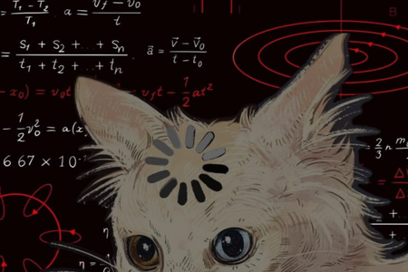

  

# Uzeb Khan

**CS (Data Science) • Delhi • 19**

_Currently exploring Deep Learning & AI_

---

### What I Do

Building ML/DS systems. Writing clean code. Breaking and fixing fast.

### Stack

`Python` `SQL` `ML/DL` `CV` `FastAPI` `Git` `Linux`  
_Learning:_ `React Native` `Detection/Segmentation`

---

---

  
**Open to Internships** • [uzebkhan.dev@gmail.com](mailto:uzebkhan.dev@gmail.com)

